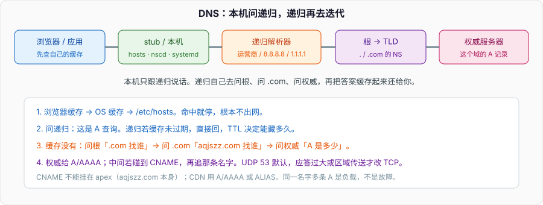

# DNS 解析：名字怎么变成 IP

浏览器地址栏里敲的是 `aqjszz.com`，网卡上发出去的包目的地址必须是 32 位或 128 位的数字。中间这一层叫 DNS。面试里它经常被压成「先查 DNS」，追问两句就露馅：递归和迭代谁干的、CNAME 为什么不能挂在根域、为什么有时候 UDP 有时候 TCP、TTL 过期了为什么还能命中旧 IP。

本篇只讲解析路径和记录类型。HTTP 怎么发、TLS 怎么握，见专栏里 HTTP/HTTPS 那篇；IP 怎么选路、家里那台路由怎么改源地址，见 IP 与 NAT。时间线串起来，见「从输入 URL 到页面显示」。



---

## 一、两套角色，不要混

DNS 里有两种「问问题的人」，职责完全不同。

**Stub resolver** 是你这台机器上的一小段库：glibc 的 `getaddrinfo`、macOS 的 mDNSResponder、浏览器自己再包一层缓存。它只认识「递归解析器」这一个上游，问完就等答案。`/etc/resolv.conf` 里那几行 nameserver，就是 stub 的上游地址。浏览器、`curl`、`ping` 最终都走到这里，只是缓存层数不一样。

**递归解析器** 是运营商、`8.8.8.8`、`1.1.1.1`、公司内网那台 Unbound / BIND。它替你把问题问完：根不知道 `aqjszz.com` 的 A，但知道 `.com` 的 NS；`.com` 不知道 A，但知道这个域的权威；权威才真正持有那条 A。递归把沿途学到的 NS、A、AAAA 按 TTL 缓存。下一次同样的问题，可能根本不出机房。

本机从来不会自己去问根。你抓包看到目的 53 的，几乎都是到递归那一跳。面试说「浏览器问根服务器」是错的。

**权威服务器** 不帮别人跑递归。它只回答自己管辖的区（zone）。有人把它配成「也做递归」，那是另一台角色叠在一起：对外既当权威又替陌生人满世界查，容易变成开放递归，给放大攻击当弹药。权威该关递归。

根、TLD、权威这三跳是 **迭代**：每台只告诉你「下一问该找谁」，并不替你把最终 A 查完。替你查完的是递归。把「迭代」说成本机行为，是常见口误。

---

## 二、一次查询实际走过的缓存

以 `curl https://aqjszz.com` 为例，名字解析在 TCP 握手之前。顺序是：

1. **应用缓存。** Chrome 自己有 DNS 缓存，和系统的不是同一份。TTL 到了它也可能多留一会儿，这就是你改了解析、浏览器还在打旧 IP 的原因之一。DevTools 的 Network 里「Remote Address」对不上 `dig` 的结果，先怀疑这一层。
2. **系统缓存。** nscd、systemd-resolved、macOS 的 mDNSResponder。`ping` 走系统，浏览器不一定走。
3. **hosts。** `/etc/hosts` 或 Windows 的 `hosts`。命中就结束，没有 TTL，优先级高于一切网络查询。本机开发把 `aqjszz.com` 写进 hosts，线上解析怎么改都影响不到你。
4. **递归。** 前面都没有，stub 发一条 UDP 查询到 53 端口。查询类型常见是 A（IPv4）和 AAAA（IPv6），现在双栈会两个都问，Happy Eyeballs 再决定连哪条。

递归侧：

- 自己缓存未过期：直接回。应答里的 TTL 是权威当时给的剩余时间，递归会往下减。客户端再缓存一次，看到的 TTL 更短。
- 缓存没有：从根提示（root hints）开始迭代。根给出 `.com` 的 NS 和 glue A；递归再问 `.com` 的权威，拿到 `aqjszz.com` 的 NS；再问那台权威，拿到 A/AAAA。

根服务器全球用 anycast，你连的「那 13 个」其实是很多台。面试背「全球 13 台根」要补一句：13 是身份（A 到 M），不是 13 台物理机。

UDP 够用就 UDP。应答超过 512 字节（没有 EDNS）或超过 EDNS 协商的大小，递归会改用 TCP。区域传送（AXFR/IXFR）从一开始就是 TCP。防火墙只放 UDP 53、不放 TCP 53，大记录和 DNSSEC 会解析失败。

查询报文本身很小：事务 ID、标志位（RD = Recursion Desired）、问题区一个 QNAME + QTYPE。应答把答案放在 Answer，把「下一问找谁」放在 Authority，把 NS 对应的 A 放在 Additional（glue）。抓包看这三段，比看 `dig` 输出更能对上协议。

---

## 三、记录类型：面试真正会问的几条

| 类型 | 干什么 | 容易踩的点 |
| --- | --- | --- |
| A | 名字 → IPv4 | 同一名字可以有多条，客户端自己选或按顺序试 |
| AAAA | 名字 → IPv6 | 双栈机器两个都查；AAAA 失败不要误判成「DNS 挂了」 |
| NS | 这个区的权威是谁 | 委派点必须有 glue，否则递归找不到权威的 IP |
| CNAME | 这个名字是另一个名字的别名 | 不能和其他记录共存；不能挂在 zone apex |
| MX | 这个域的邮件服务器 | 值是主机名，还要再查 A/AAAA |
| TXT | 任意文本 | SPF、DKIM、所有权验证都走它 |
| SOA | 区的管理信息 | 序列号给从权威做区传送；否定缓存 TTL 也参考它 |
| PTR | IP → 名字 | 反向解析，邮件服务器常用；和 A 没有强制互证 |
| SRV | 服务发现 | `_sip._tcp.example.com`，K8s / 部分 RPC 还在用 |
| CAA | 哪些 CA 能签这个域 | 申请证书时 CA 会查；和浏览器校验无关 |

CDN 把 `www` 指到自己的接入名，通常是 CNAME。`aqjszz.com` 这个 apex 不能 CNAME：协议规定 CNAME 所在节点不能再有 NS、SOA、A。所以根域上 CDN 给你的是 A/AAAA，或者注册商提供的 ALIAS/ANAME（那是权威侧的合成，客户端看见的还是 A）。

CNAME 可以链式追。递归每追一跳都要再查，TTL 取沿途最短的那条。链太长、环、中间某跳 NXDOMAIN，都是线上「偶发解析失败」的来源。自己做接入时，CNAME 一层就够。

TTL 不是「保证这段时间解析不变」，是「递归最多藏这么久」。权威改记录之后，全球要等各家缓存过期。TTL 设 60 秒，切流量快，递归压力大；设 86400，改一次要等一天。证书申请、主备切换之前，先把 TTL 降下去，等旧缓存自然过期，再改记录。

**否定缓存** 经常被忘掉。查一个不存在的名字，权威回 NXDOMAIN，递归会按 SOA 里的 MINIMUM（现在多半用 SOA TTL）把「没有」也缓存一段时间。刚加的子域立刻去解析，可能撞上刚才的否定缓存，表现为「记录已经加上了，有的地方还是没有」。NODATA（名字在、这种类型没有）和 NXDOMAIN 不是一回事：`aqjszz.com` 有 A、没有 AAAA，AAAA 查询是 NODATA，不是「这个域不存在」。

同一名字多条 A，是 DNS 轮询，不是故障。客户端或递归选哪一条没有统一标准：有的按顺序，有的按 RTT。它做不到会话保持，真正的负载均衡还得靠四层/七层。把 DNS 轮询当「灰度发布」会很痛，因为缓存和各家递归不同步。

---

## 四、Glue、委派、权威怎么找到

`aqjszz.com` 的 NS 如果是 `ns1.aqjszz.com`，递归拿到 NS 名字之后还要再解析这个名字——可这个名字又在本区里，形成环。解决办法是 **glue**：父区（`.com`）在 Additional 里直接带上 `ns1.aqjszz.com` 的 A/AAAA。没有 glue，委派点解析不出来。

换 NS、换权威 IP，要同时改：

1. 新权威上的区数据；
2. 注册商处的 NS 和 glue；
3. 等父区 TTL 和各家递归过期。

只改 1 不改 2，一部分递归还在打旧机器。本站 NS 从 DNSPod 切到华为云时，旧权威如果还在应答，就会出现「有人能打开、有人 NXDOMAIN」——不是浏览器的问题，是两套权威同时在说话，看你撞上哪家递归的缓存。切 NS 之前，先确认新权威已经能正确答 A；切完之后，旧权威尽快停掉或改成和新的一致。

权威之间的主从靠区传送。主权威改 SOA 序列号，从权威过来拉。序列号不会自动「变大」，忘了加序号，从库一直认为自己是新的。这和 MySQL binlog 位点是同一类运维事故，只是协议换成了 DNS。

---

## 五、本机排障顺序

`ping` 通、浏览器不通，先分清是解析问题还是连接问题。解析失败：没有 Remote Address，没有 TCP SYN。连接失败：已经有 IP，SYN 发出去没回来。

```bash
# 绕过本机缓存，直接问指定递归
dig @8.8.8.8 aqjszz.com A +ttlunits

# 看完整追踪：根 → TLD → 权威
dig aqjszz.com A +trace

# 只看权威给的，不管递归缓存
dig aqjszz.com A +norecurse @ns1.huaweicloud.com

# 本机 stub 实际走哪台
scutil --dns          # macOS
resolvectl status     # systemd-resolved

# 同时看 A 和 AAAA
dig aqjszz.com A aqjszz.com AAAA
```

`dig` 默认 UDP。加 `+tcp` 才能复现「UDP 被截断」那类故障。`nslookup` 在不同操作系统行为不一致，排障优先 `dig`。

hosts 里有脏数据时，所有工具都会被骗，因为 stub 先读 hosts。排查「为什么解析不到新 IP」的第一件事是看 hosts，第二件事是看浏览器自己的缓存，第三才是递归 TTL。

`dig +trace` 从根走，不走你本机的递归缓存，所以它看到的「已经生效」和用户那边「还没生效」可以同时成立。对外沟通切流进度，要以多家公共递归（运营商、`8.8.8.8`、`1.1.1.1`）的剩余 TTL 为准，不要以自己 `+trace` 为准。

---

## 六、安全上多问一句

DNS 明文。路径上的人可以抢答，把 `aqjszz.com` 指到钓鱼 IP。缓解不是「换一个递归」这么简单：

- **DNSSEC**：权威给记录签名，递归校验。防的是篡改，不加密查询内容。部署成本和校验失败时的可用性，是两件事。签名过期、时钟不准，会让整域解析失败，比「没开 DNSSEC 被劫持」更常见。
- **DoT / DoH**：查询走 TLS 或 HTTPS，旁路看不到你问了哪个名字。DoH 把 DNS 混进 443，公司出口策略会头痛：不能再按 53 端口拦。
- **HSTS / 证书校验** 解决不了 DNS 本身，但能让「解析被劫持之后用假证书」在浏览器这层失败。

面试问「HTTPS 是不是就不怕 DNS 劫持」：连接加密的是对端，对端是不是你以为的那台，取决于证书校验。劫持者没有合法证书，TLS 会断。用户点「继续访问」就另说。HTTP 明文站点被劫持，浏览器没有这层保护。

开放递归加上应答放大（小查询、大 TXT/ANY），是 DDoS 的经典弹药。权威关掉递归、限制 ANY、开启响应速率限制，是运维默认项，不是「安全专题」。

---

## 七、后端自己也会做 DNS

K8s 的 Service 名、CoreDNS、AWS 的 ALB 别名、Consul 的 SRV，本质都是 DNS：权威在集群里，TTL 更短，失败要按应用重试，不能假设「解析一次用一辈子」。

短 TTL 的代价是 QPS。每个 Pod 都把 `nameserver` 指到 CoreDNS，一次滚动发布会打出一波解析。应用侧要缓存，但缓存不能长过 TTL 太多，否则 Service 换 IP 还在打旧 Endpoints。`ndots`、search domain 会让一次查询先补一串后缀再问绝对名，容器里常见的「解析特别慢」有一半出在这里。

Split-horizon（内网答内网 IP，公网答公网 IP）靠的是权威看源地址或单独的视图。公司内网把 `aqjszz.com` 指到测试机，回家走公共递归就是线上。同一台笔记本 VPN 通不通，解析结果可以完全不同。排障先问「你当时的 nameserver 是哪台」。

---

## 八、面试收口

- 本机只问递归，递归才去迭代。不要说浏览器问根。
- CNAME 不能挂 apex，不能和 NS/SOA/A 共存。CDN 根域用 A 或 ALIAS。
- TTL 是缓存上限，不是变更生效时间。否定缓存会让「刚加上的记录」暂时看不见。
- 切 NS 要新旧权威同时正确，旧的不要继续答另一份数据。
- HTTPS 防的是「连上之后被窃听/冒充」，防不了「名字被指到另一台」本身；证书校验是第二道。

解析完拿到 IP，下一步是三次握手，见 TCP/UDP 详解。目的 IP 若不在本网段，出接口要改成网关，源地址可能被 NAT 改掉，见 IP 与 NAT。
