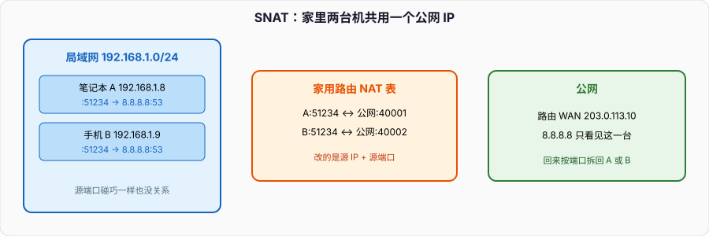

# IP 与 NAT：包如何离开本机网段

TCP 保证的是两端字节流。真正把一份数据报从这台机器送到那台机器的，是 IP。面试常把 IP 当成「地址格式」，追问 NAT 之后源端口为什么变了、回包怎么找回来、为什么有的 P2P 打洞失败，就答不利落。

本篇从一张以太网帧里的 IP 头说起，落到家用路由和云上的 SNAT。ARP 在同一广播域里把下一跳 IP 换成 MAC，总结篇已经画过；这里不再重复 ARP 流程。和 DNS、TCP、HTTP 串起来的时间线，见「从输入 URL 到页面显示」。



---

## 一、IP 做三件事

1. **寻址。** IPv4 是 32 位，IPv6 是 128 位。地址分网络前缀和主机部分，前缀长度写成 `/24` 这种。同一前缀里的机器，二层能直接送到；跨前缀必须交给路由器。
2. **选路。** 主机只有一张简陋的路由表：本网段走网卡，默认走网关。路由器的表可以很大，用最长前缀匹配。OSPF、BGP 是填这张表的协议，不是转发平面本身。
3. **分片。** MTU 不够时，IPv4 路由器可以切开数据报，IPv6 路由器不切，让源主机用 Path MTU Discovery 自己缩小。TCP 通常用 MSS 夹在三次握手里谈好，尽量不分片。UDP 大包更容易踩分片，丢一片整份重传。

IP 是尽力而为、无连接的。不保证顺序，不保证必达，不帮你重传。那些是传输层的事。ICMP 是 IP 的配套：Ping 的 Echo、TTL 耗尽的 Time Exceeded、不可达的 Destination Unreachable。`traceroute` 就是靠 TTL 从 1 往上加，等每跳回 ICMP。

IPv4 头里面试会盯的字段：

- **TTL / Hop Limit：** 每过一台路由器减 1，到 0 丢弃。环路靠这个停，不是靠 IP 自己记路径。
- **Protocol：** 6 是 TCP，17 是 UDP，1 是 ICMP。NAT 表的键通常要把协议算进去，否则 TCP 和 UDP 同一个四元组会撞。
- **Identification / Flags / Fragment Offset：** 分片用。DF 位置 1 表示「不要分片，MTU 不够就回 ICMP」。
- **源 / 目的地址：** 没有 NAT 时端到端不变。二层 MAC 每跳都换，三层地址原则上不换——直到 NAT 改它。

私网地址（RFC 1918：`10/8`、`172.16/12`、`192.168/16`）在公网上没有路由。能上网，是因为出口做了 NAT。`127.0.0.0/8` 是本机环回，出不了网卡。`169.254.0.0/16` 是链路本地，DHCP 失败时常见，不是你的业务网段。

CIDR 把「A/B/C 类」废掉了。`10.0.0.0/9` 和 `10.128.0.0/9` 是两段。路由查找用最长前缀：`10.1.2.3` 同时匹配 `/8` 和 `/16` 时走 `/16`。默认路由是 `/0`。主机上的 `0.0.0.0/0 via 192.168.1.1` 就是「剩下的都交给网关」。

---

## 二、主机发出一个包时查什么

假设笔记本 `192.168.1.8/24`，网关 `192.168.1.1`，要访问 `8.8.8.8:53`。

1. 应用给出目的 IP 和端口。传输层封 UDP/TCP 头。
2. IP 层查路由：`8.8.8.8` 不在 `192.168.1.0/24`，匹配默认路由，下一跳是 `192.168.1.1`，出接口是那张无线网卡。
3. 下一跳在本网段，用 ARP（IPv6 是 Neighbor Discovery）问 `192.168.1.1` 的 MAC。
4. 帧的目的 MAC 是网关，目的 IP 仍然是 `8.8.8.8`。二层地址每跳都换，三层地址端到端不变——**直到 NAT 改它**。

同网段访问（`192.168.1.8` ping `192.168.1.9`）不走网关：路由命中直连网段，ARP 问的是对端自己，帧的目的 MAC 就是对端。面试把「所有包都先交给网关」说成默认行为，是错的。

云上的弹性网卡、容器的 veth、本机的 loopback，都是同一套：先查路由，再解析下一跳的二层地址。容器访问外网多半还要经过宿主机的 SNAT，和家用路由是同一个动作。

策略路由（按源地址、按 mark 选表）是进阶项。多网卡机器「流量走错口」，经常是默认路由只有一条，或 SNAT 之后回包从另一张网卡进来，反向路径不一致。云上的「辅助网卡不能出公网」，查的也是这张表。

---

## 三、NAT：改的是五元组里的「源」

IPv4 地址不够用。一家几个设备共用运营商给的一个公网 IP，靠的是 NAPT（通常口头叫 NAT）：改源 IP，必要时改源端口，并记一张表。

还是上面那个包：

```
原：192.168.1.8:51234 → 8.8.8.8:53
出：203.0.113.10:40001 → 8.8.8.8:53
表：192.168.1.8:51234 ↔ 203.0.113.10:40001  （针对 8.8.8.8:53 这一流）
```

`8.8.8.8` 看见的源是路由的公网地址。应答回到 `203.0.113.10:40001`，路由查表，改回 `192.168.1.8:51234`，再从 LAN 口送进去。

两台内网机器源端口碰巧都是 51234 也没关系，路由会映射成不同的公网端口。表项有超时：UDP 短、TCP 按连接状态更长。表被冲掉，内网还以为连接活着，外网回包会丢——这就是「NAT 超时」类故障。长连接要靠应用心跳或 TCP keepalive 把表项续上。

Linux 里这张表叫 **conntrack**。`iptables` 的 masquerade / SNAT 是规则，真正记住流的是 conntrack。表满了（`nf_conntrack_max`），新连接直接失败，表现为偶发超时，很像应用 bug。容器密集的机器要盯这个计数。

按改写方向分：

- **SNAT / 源 NAT：** 内网访问外网。家用路由、云上的「出公网」、Docker 桥接出宿主机。
- **DNAT / 目的 NAT：** 外网访问内网某台。端口映射、负载均衡把 `公网:443` 转到 `10.0.1.8:8080`。
- **双向都改：** 有的负载均衡对后端也做 SNAT，让回包必须再走它，避免直连服务器把响应绕开均衡器（Direct Server Return 则故意不 SNAT，后端自己把源地址填成 VIP）。

**Masquerade** 是 SNAT 的动态版：出口地址跟着网卡变。拨号、DHCP 换公网 IP 时用它。固定弹性 IP 用 SNAT 指死地址更干净。

Hairpin NAT（NAT loopback）：内网机器访问「自己家的公网 IP:443」，包出到路由再被 DNAT 回来。没有 hairpin，内网访问公网域名会失败，必须走内网地址或 split-horizon DNS。家用路由大多开了；云上安全组 / ACL 不一定允许这圈。

Full Cone、Restricted Cone、Port Restricted、Symmetric，是 STUN 里对「表项宽松程度」的分类。对称型 NAT 对每个目的都换新端口，P2P 打洞最难。家用路由多数是端口受限或对称，所以视频通话要靠 TURN 中继兜底。CGNAT（运营商级 NAT）把整栋楼再套一层，打洞成功率更差，应用不能假设「公网 IP 就是用户」。

IPv6 地址空间够大，端到端本可以不做 NAT。实际运营商和云厂商仍有 NAT66、NAT64，那是策略和存量 IPv4 的问题，不是地址不够。NAT64 让纯 v6 主机访问 v4 服务，DNS 侧配合 DNS64 把 A 合成 AAAA。

---

## 四、分片、MSS、和 NAT 叠在一起

以太网 MTU 一般 1500。IP 头 20，TCP 头 20，MSS 就按 1460 谈。中间若有隧道（VXLAN、PPPoE、IPsec）再吃几十字节，实际路径 MTU 更小。IPv4 路由器可以分片，但：

- 分片在 NAT 上很烦：端口号在传输头里，只有第一片有。NAT 必须重组或跟踪分片 ID，后续片才能对上表。
- 任一片丢失，整份重传。UDP 尤其惨。
- 有的中间盒直接丢分片。

所以传输层的正确做法是 **不分片**：TCP 用 MSS 和 PMTUD；UDP 自己把报文控制在 1200 附近（QUIC 就是这个思路）。ICMP「需要分片」被防火墙丢掉时，PMTUD 黑洞出现：连接能握手，大包开始就卡住。排障用 `ping -M do -s 1472` 二分 MTU，或抓「DF=1 的包出去、没有应答」。

---

## 五、和连接、安全的关系

TCP 的四元组（源 IP、源端口、目的 IP、目的端口）在经过 NAT 后，对端看到的源 IP/端口不是进程 bind 的那个。服务端日志里的 client IP，在 SNAT 后面是 NAT 设备的地址。要拿到真实客户端，HTTP 靠 `X-Forwarded-For` / `Forwarded`，四层靠 Proxy Protocol。信任这些头的前提是：只有你自己的反向代理会加，公网来的伪造头要丢掉。

安全组、iptables、云上的 ACL，匹配的是改写前还是改写后，取决于规则挂在哪一块链、哪一张网卡。DNAT 之后目的 IP 已经变成内网，LAN 侧的防火墙要用内网地址写规则。`iptables` 的顺序是：PREROUTING（DNAT）→ 路由决策 → FORWARD / INPUT → POSTROUTING（SNAT）。规则写错链，表现为「安全组已经放行但仍超时」。

容器网络几乎都是这套的缩小版：

- Docker bridge：veth + 网桥 + 宿主机 masquerade。容器源 IP 出宿主机就没了。
- K8s：Pod IP 在集群内可路由时，出集群仍要 SNAT。`externalTrafficPolicy: Local` 是为了少做一层 SNAT、保住客户端 IP，代价是均衡不均匀。
- `hostNetwork: true` 直接用宿主机网络栈，没有这层 NAT，也没有隔离。

---

## 六、排障时看哪

```bash
# 本机路由
ip route            # Linux
netstat -rn         # 跨平台老接口
# 下一跳是否在 ARP 里
ip neigh
arp -an
# conntrack 是否撑满
conntrack -C
# 经过 NAT 之后对端看到的地址
curl ifconfig.me
```

`traceroute` 每一跳是路由器，不是 NAT 表。NAT 是某一跳路由器内部的改写，路径上看不见「NAT 这一层」。要确认 SNAT 有没有发生，对比本机源地址和对端日志里的源地址。

云厂商控制台里的「弹性 IP」「NAT 网关」「负载均衡」，对应的就是公网 IP 绑定、SNAT 集群、DNAT + 可选 SNAT。原理和家里那台盒子相同，只是表更大、高可用、要按流量计费。弹性 IP 绑在网卡上，有的路径可以不做 SNAT，对端看到的就是那张弹性 IP。

本机有多张网卡、VPN、Docker 同时开着时，`ip route get 8.8.8.8` 比看完整路由表更直接：它告诉你这个目的实际走哪张口、哪一跳。

---

## 七、面试里收口

- 「IP 和 TCP 谁可靠？」IP 不可靠。可靠是 TCP 用序号、确认、重传堆出来的。
- 「NAT 改了什么？」通常改源 IP 和源端口，用五元组（含协议）做键。回包按表改回去。
- 「为什么内网服务器外网连不上？」没有 DNAT / 没有公网 IP。SNAT 只解决「出去」，不解决「进来」。
- 「容器里看到的源 IP 怎么丢了？」出宿主机做了 SNAT。要保留源 IP，用 hostNetwork、Proxy Protocol，或把均衡器的 DNAT 和后端放在能直接回包的拓扑里。
- 「为什么大包传不过去、小包可以？」路径 MTU，PMTUD 黑洞，或 NAT/隧道不会处理分片。

和 DNS、TCP、HTTP 串起来的时间线，见「从输入 URL 到页面显示」。
