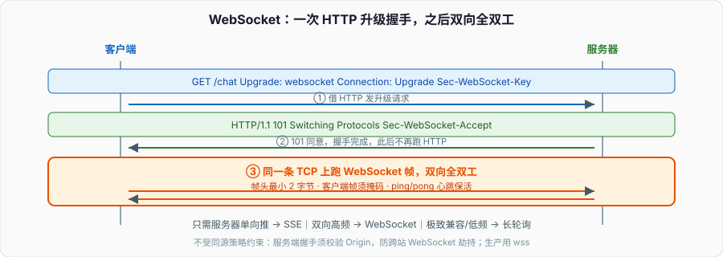

# WebSocket：从「请求—响应」到「双向长连接」

HTTP 是请求—响应模型：客户端问一句，服务器答一句，答完这轮就结束。可很多场景要的是**服务器主动推**——聊天消息、股价、协同编辑、游戏状态。在 WebSocket 之前，前端只能靠轮询硬凑：定时发请求问「有新消息吗」,绝大多数请求都是空的，浪费带宽和连接，还有延迟。WebSocket 就是为「服务器能主动、双向、实时地推」而生的。

面试问 WebSocket，重点不是 API 怎么调，而是：它和 HTTP 什么关系、那个「升级握手」到底做了什么、为什么它能省掉轮询的开销、以及它和长轮询/SSE 怎么选。



---

## 一、轮询的困境：HTTP 天生不适合「服务器推」

在 WebSocket 前，实现「实时」有几种凑法，各有代价：

- **短轮询**：客户端每隔几秒发一次请求问有没有新数据。实现简单，但延迟高（取决于间隔）、绝大多数请求是空响应、每次都要建连接/带完整 HTTP 头，浪费严重。
- **长轮询（long polling）**：客户端发请求，服务器**hold 住不立刻回**,直到有数据或超时才响应;客户端收到后立即再发一个。比短轮询实时，但每条消息仍是一次完整的请求—响应，服务器要挂住大量连接，头部开销依旧。

根本矛盾是：HTTP 是**半双工的请求—响应**,服务器**不能主动**给客户端发消息，只能等客户端问。所有「凑」出来的实时，都是在用客户端反复提问来模拟服务器主动推。WebSocket 直接改变模型：建立一条**全双工**的持久连接，两端都能随时主动发。

---

## 二、升级握手：借 HTTP 起步，然后换协议

WebSocket 不是凭空另起炉灶，它**借用一次 HTTP 请求来「升级」**。客户端发一个特殊的 HTTP GET：

```
GET /chat HTTP/1.1
Host: example.com
Upgrade: websocket
Connection: Upgrade
Sec-WebSocket-Key: dGhlIHNhbXBsZSBub25jZQ==
Sec-WebSocket-Version: 13
```

关键是 `Upgrade: websocket` 和 `Connection: Upgrade`——告诉服务器「我想把这条连接从 HTTP 协议切换成 WebSocket」。服务器同意就回 **101 Switching Protocols**：

```
HTTP/1.1 101 Switching Protocols
Upgrade: websocket
Connection: Upgrade
Sec-WebSocket-Accept: s3pPLMBiTxaQ9kYGzzhZRbK+xOo=
```

`Sec-WebSocket-Accept` 是把客户端的 `Sec-WebSocket-Key` 拼上一个固定魔术字符串再做 SHA-1 + Base64 算出来的。它**不是加密**,目的是证明「服务器确实理解 WebSocket 协议」,防止普通 HTTP 服务器或缓存代理误把这当普通请求处理。握手一旦完成（101 之后），**这条 TCP 连接就不再跑 HTTP 了**,改跑 WebSocket 的帧协议，双向全双工。

所以 WebSocket 和 HTTP 的关系是：**用 HTTP 完成握手/升级，之后复用同一条 TCP 连接跑自己的协议**。它走的端口还是 80/443（`ws://` / `wss://`），`wss` 就是 WebSocket over TLS,跟 HTTPS 一样加密。这也是它能穿过大部分防火墙/代理的原因——起手看起来就是个普通 HTTP 请求。

---

## 三、帧协议：为什么开销比 HTTP 小得多

握手后的数据以**帧（frame）**为单位收发。帧头很小（最小 2 字节），包含：操作码（文本/二进制/关闭/ping/pong）、是否分片、掩码标志、以及负载长度。对比 HTTP 每个消息动辄几百字节的头部（Cookie、User-Agent、各种头），WebSocket 一条消息可能只有几字节头——这是它比轮询高效的核心：**建一次连接、握一次手，之后每条消息几乎没有协议开销，也不用反复带 Cookie 和 HTTP 头。**

几个协议细节常被问到：

- **掩码（masking）**：客户端发给服务器的帧**必须掩码**（用一个随机值异或负载），服务器发给客户端的**不掩码**。这不是为了加密（`wss` 才管加密），而是防止「缓存投毒」——防中间的老旧代理把 WebSocket 帧误解析成 HTTP 请求做缓存。
- **控制帧**：`ping`/`pong` 用来做心跳保活。长连接经过 NAT/代理，空闲久了连接表项会被回收（见 IP 与 NAT），所以要定期 ping 让连接「看起来活着」,也用来探测对端是否还在。
- **分片**：大消息可以拆成多帧发。

---

## 四、和 SSE、长轮询怎么选

不是所有「实时」都得上 WebSocket。三个方案对应不同需求：

- **长轮询**：兼容性最好（就是 HTTP），实现简单，适合低频、对实时性要求不极致、且不想引入新协议的场景。代价是效率低。
- **SSE（Server-Sent Events）**：基于 HTTP 的**单向**（服务器→客户端）持续推送，用 `text/event-stream`,浏览器原生 `EventSource` 支持自动重连。适合「只需要服务器推、客户端不需要频繁上行」的场景：股价、通知、日志流。比 WebSocket 简单，走标准 HTTP，但只能单向、只能文本。
- **WebSocket**：**双向、全双工、低开销**,适合高频双向交互：聊天、协同编辑、多人游戏、实时协作。代价是它不是普通 HTTP，服务器要专门支持，负载均衡/代理要配置支持长连接，重连和状态管理要自己做。

选择逻辑：只需服务器单向推 → SSE;需要双向高频 → WebSocket;要极致兼容或很低频 → 长轮询兜底。别一上来就 WebSocket，很多「实时通知」用 SSE 更省心。

---

## 五、工程上的坑

- **它是有状态长连接**，和 HTTP 的无状态短连接运维模型完全不同。服务端要维护每个连接的状态，水平扩展时「用户 A 连在实例 1、要给他推的消息产生在实例 2」怎么办？靠消息队列/Redis 发布订阅在实例间转发，或用支持连接路由的网关。这是 WebSocket 集群化的核心难题。
- **重连与消息可靠性**：连接会断（网络抖动、NAT 超时、服务重启）。客户端要实现指数退避重连;断线期间的消息要不要补发、怎么去重，得应用层自己设计（序列号、ack）。WebSocket 只保证「连着的时候双向通」,不保证「断了不丢消息」。
- **安全**：WebSocket **不受同源策略约束**（握手请求能跨源发起），所以不能靠 SOP 防跨站——服务端握手时必须**校验 Origin 头**,否则会有类似 CSRF 的「跨站 WebSocket 劫持」。这正是上一篇 Web 安全的延伸：模型一变（从短连接变长连接、从受 SOP 约束变不受约束），安全假设就得重新审。生产用 `wss://` 加密，并做鉴权（握手时校验 token/Cookie）。

---

## 六、面试收口

- **WebSocket 和 HTTP 什么关系？** 借一次 HTTP 请求做「升级握手」（`Upgrade: websocket` → 101 Switching Protocols），之后同一条 TCP 连接改跑 WebSocket 帧协议，全双工。端口仍是 80/443，`wss` 是加密版。
- **为什么比轮询高效？** 建一次连接、握一次手，之后每条消息帧头极小、不带 HTTP 头和 Cookie;而轮询每条消息都是完整请求—响应。
- **客户端帧为什么要掩码？** 防中间老旧代理把帧误解析成 HTTP 做缓存投毒，不是为加密。
- **和 SSE 怎么选？** 只需服务器单向推用 SSE（走标准 HTTP、原生重连）;需双向高频用 WebSocket。
- **集群化难在哪？** 有状态长连接，跨实例推送要靠消息队列/发布订阅转发;断线重连和消息可靠性要应用层自己做。
- **安全注意？** 不受同源策略约束，服务端握手必须校验 Origin，防跨站 WebSocket 劫持;用 wss + 握手鉴权。

WebSocket 把网络专栏从「请求—响应」带到「长连接、双向、有状态」,它建在 TCP 之上（见 TCP/UDP）、借 HTTP 起步（见 HTTP/HTTPS）、心跳绕开 NAT 超时（见 IP 与 NAT）、安全接续上一篇——是把整个网络专栏串起来的一个很好的收尾场景。
