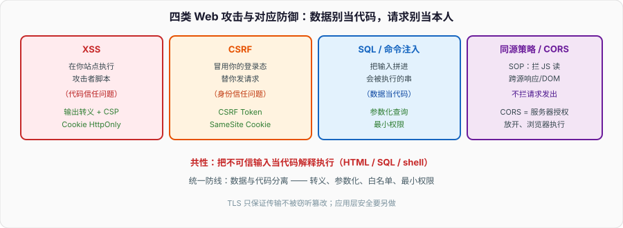

# Web 安全：同源策略、XSS、CSRF 与注入，一次讲清攻防对应

HTTP 那篇讲了报文和 TLS，但「连接是加密的」不等于「应用是安全的」。绝大多数 Web 漏洞发生在 TLS 之上的应用层：别人往你页面塞脚本、借你的登录态发请求、把恶意串拼进你的 SQL。这些不需要破解加密，只需要你的代码信任了不该信任的输入。

面试和实际开发都绕不开这几个：同源策略到底拦什么、XSS 和 CSRF 区别在哪（经常被搞反）、CORS 是「放开限制」不是「加强安全」、SQL 注入为什么参数化查询能根治。把「攻击原理 → 对应防御」成对记，比背名词有用。

---

## 一、同源策略：浏览器安全的地基

**同源策略（Same-Origin Policy, SOP）**是浏览器最基础的安全机制：一个源的脚本，默认不能读取另一个源的资源。「同源」= 协议、域名、端口**三者全同**。`https://a.com` 和 `http://a.com`（协议不同）、`https://a.com` 和 `https://b.a.com`（域名不同）、`https://a.com` 和 `https://a.com:8080`（端口不同）都是跨源。

它拦的是**读取**：`a.com` 的页面可以向 `b.com` 发请求（比如 ``、表单提交、`fetch`），但**默认读不到 `b.com` 的响应内容**,也读不到 `b.com` 页面的 DOM、Cookie。没有 SOP，你打开的任意网页都能用 JS 读你正登录着的网银页面。

要注意 SOP 拦的是「JS 读跨源响应」,**不拦请求发出去**。这个区别正是 CSRF 能成立的根源（下面讲）：请求照样带着 Cookie 发出去了，只是攻击者读不到响应——但很多请求（转账、改密码）的目的是「产生副作用」,不需要读响应。

---

## 二、XSS：把脚本注入到别人的页面里

**跨站脚本（XSS）**的本质：攻击者的脚本在**受害者的浏览器里、以受害站点的身份**执行。一旦脚本跑起来，同源策略对它形同虚设——它就是「站点自己的脚本」,能读 Cookie、发请求、改页面。三种类型：

- **存储型**：恶意脚本存进了服务器（比如评论区提交 ``），别人访问就中招。危害最大，因为持久、影响所有访问者。
- **反射型**：脚本在 URL 参数里，服务器原样回显到页面（比如搜索结果页把关键词直接输出）。需要诱骗受害者点特制链接。
- **DOM 型**：漏洞在前端 JS，比如 `innerHTML = location.hash`,不经过服务器，纯客户端把用户输入当 HTML 执行。

**根因是「把用户输入当代码执行」。** 防御核心是**输出编码 + 输入校验**：

- **输出转义**：把内容渲染到 HTML 时，`<` → `&lt;`、`>` → `&gt;`、`"` → `&quot;`,让浏览器当文本显示而非标签。这是最关键的一步——现代框架（React、Vue）默认对插值转义，所以直接 `{{ userInput }}` 是安全的;危险的是 `dangerouslySetInnerHTML` / `v-html` 这类「我保证这是安全 HTML」的后门。
- **CSP（内容安全策略）**：响应头 `Content-Security-Policy` 声明「只准执行来自这些源的脚本」「禁止内联脚本」。即使注入进去，浏览器也拒绝执行，是纵深防御的一层。
- **Cookie 加 `HttpOnly`**：JS 读不到这个 Cookie，即使 XSS 得手也偷不走会话 Cookie。

---

## 三、CSRF：借你的登录态，替你发请求

**跨站请求伪造（CSRF）**和 XSS 常被搞混，但机理相反：XSS 是「在你的站点跑攻击者的脚本」;CSRF 是「攻击者的站点，冒用你的身份，向你的站点发请求」。

原理：你登录了 `bank.com`,浏览器存了它的会话 Cookie。你又访问了恶意站 `evil.com`,页面里藏了 `` 或一个自动提交的表单。浏览器发这个请求时，**会自动带上 `bank.com` 的 Cookie**（Cookie 是按目标域自动附加的，不管请求从哪个页面发起）。`bank.com` 看到合法 Cookie，以为是你本人操作，转账成功。攻击者读不到响应（SOP 拦着），但转账这个副作用已经发生。

关键点：CSRF **不需要读响应，也不偷 Cookie**,它利用的是「浏览器自动带 Cookie」这个行为。所以 `HttpOnly` 防不了 CSRF（那是防 XSS 偷 Cookie 的）。防御：

- **CSRF Token**：服务器给表单塞一个随机 token，提交时校验。攻击者的跨源页面拿不到这个 token（SOP 拦着它读你的页面），伪造的请求缺 token 被拒。这是最标准的防御。
- **SameSite Cookie**：给 Cookie 设 `SameSite=Lax`（现代浏览器默认）或 `Strict`,跨站请求就**不自动带**这个 Cookie，CSRF 直接失效。这是目前最省事有效的防线。`Lax` 允许顶级导航（点链接跳过去）带 Cookie，兼顾体验;`Strict` 完全不带，最安全但可能影响从外站跳入的登录态。
- **校验 Origin/Referer**：检查请求来源是不是本站。辅助手段。

记法：**XSS 是「代码信任问题」（把输入当代码），CSRF 是「身份信任问题」（把请求当本人）。**

---

## 四、CORS：不是放松安全，是有条件地开个口

**CORS（跨源资源共享）**常被误解成「安全机制」,其实它是**对同源策略的受控放开**。默认 SOP 不让 `a.com` 读 `b.com` 的响应;但有时这就是我们要的（前端 `a.com` 调 API `api.a.com`）。CORS 让**被访问方（服务器）**通过响应头声明「我允许哪些源读我」：

- 简单请求（GET/POST 等 + 特定 header）：浏览器直接发，服务器回 `Access-Control-Allow-Origin: https://a.com`,浏览器才把响应交给 JS;不匹配就拦在浏览器这层（请求其实到了服务器，只是 JS 读不到响应）。
- 复杂请求（PUT/DELETE、自定义 header 等）：浏览器先发 **预检 `OPTIONS`** 问「我能不能这么请求」,服务器批准了才发真正的请求。

两个常被搞错的点：**CORS 是服务器授权、浏览器执行的**——绕过浏览器（如用 curl、后端调）根本没有 CORS 一说，它只在浏览器里生效。所以「CORS 报错」是浏览器拦的，不代表请求没到后端。还有 `Access-Control-Allow-Origin: *` 配上带凭证的请求（Cookie）是不允许的、也是危险的，生产要精确白名单，别图省事用 `*`。

---

## 五、SQL 注入与命令注入：拼字符串的原罪

**SQL 注入**：把用户输入直接拼进 SQL。经典例子 `"SELECT * FROM users WHERE name='" + input + "'"`,输入 `' OR '1'='1` 就变成 `WHERE name='' OR '1'='1'`,恒真，绕过认证;输入 `'; DROP TABLE users;--` 更是灾难。根因和 XSS 同构：**把数据当成了代码**。

根治手段是**参数化查询（预编译语句 / PreparedStatement）**：SQL 结构和数据分开传给数据库，`WHERE name = ?`,`?` 的值无论是什么都只当**数据**,不会被解析成 SQL 语法。这从机制上杜绝注入，而不是靠「过滤危险字符」那种黑名单（总有漏网）。ORM 默认用参数化，但拼接原生 SQL 时依然会中招。最小权限（应用账号别用 root）、不回显数据库错误（防信息泄露）是纵深防御。

**命令注入**同理：把用户输入拼进 shell 命令（`system("ping " + input)`,输入 `; rm -rf /`）。防御是别拼 shell、用参数数组形式执行（`execve` 传参数列表而非命令字符串），对应到「构造命令时用参数化而非字符串插值」。

这类「注入」漏洞的共性是一句话：**任何时候把不可信输入拼进「会被解释执行的串」（SQL、HTML、shell、LDAP、正则），都可能注入。防御的统一思路是让数据和代码分离——参数化、转义、白名单。**

---

## 六、面试收口

- **同源策略拦什么？** 拦「JS 读跨源响应/DOM/Cookie」,不拦请求发出去。协议+域名+端口全同才算同源。
- **XSS 和 CSRF 的区别？** XSS 在你的站点执行攻击者脚本（代码信任问题），防御靠输出转义 + CSP + HttpOnly;CSRF 用你的登录态发请求（身份信任问题），防御靠 CSRF Token + SameSite Cookie。HttpOnly 防不了 CSRF。
- **CORS 是安全机制吗？** 不是，是同源策略的受控放开，由服务器授权、浏览器执行;只在浏览器生效，别用 `*` 配凭证。
- **SQL 注入怎么根治？** 参数化查询（预编译），让数据和 SQL 结构分离;不是靠过滤黑名单。
- **这些漏洞的共性？** 把不可信数据当代码解释执行。统一防线是「数据与代码分离」：转义、参数化、白名单、最小权限。

Web 安全是应用层的攻防，建在 HTTP/HTTPS（TLS 只保证传输不被窃听篡改，见 HTTP/HTTPS 那篇）和同源策略之上。下一篇 WebSocket 会看到：一旦升级成长连接，CSRF 那套「浏览器自动带 Cookie」的假设也随之变化，安全模型要重新审视。
