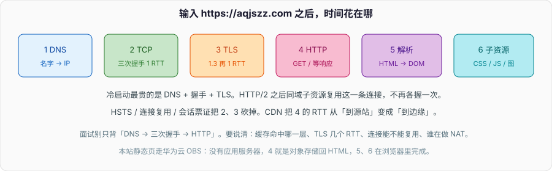

# 从输入 URL 到页面显示

面试官说「从输入 URL 到页面显示，中间发生了什么」，要的不是背十个名词，是你能不能按时间把已经学过的块串起来，并指出每一步可能卡在哪、缓存命中了哪一层。DNS、TCP、TLS、HTTP 专栏里都有专篇，本篇当目录用：只写顺序、RTT 和本站这种静态托管实际少了哪几步。

HTTP 那篇第 1.7 节也列过一遍流程，偏报文和缓存头。这里按时间轴重写，补上 HSTS、连接池、TLS 几个 RTT、NAT、以及 `aqjszz.com` 这种没有应用服务器的路径。



以 `https://aqjszz.com/` 为例。本站 HTML 在华为云 OBS 上，没有应用服务器、没有数据库。有动态后端的站点在第 4 步之后还会多出应用和存储，那是另一段，别和网络路径混在一起答。

---

## 一、浏览器先做的几件本地事

地址栏的字符串要先变成「协议、主机、端口、路径」。没有写协议时，现代浏览器按 HSTS 列表或启发式加 `https://`。端口没写就用 443 或 80。路径没写就是 `/`。用户输入 `aqjszz.com` 和粘贴完整 URL，后面差的就是这一步有没有一次 80→443 的跳转。

然后查 **HSTS**。若这个主机曾经通过 HTTPS 声明过「以后只走 HTTPS」（响应头 `Strict-Transport-Security`，或预置列表），浏览器不会先发明文 HTTP 再 301，直接按 HTTPS 走。第一次访问没有这份记忆，可能多一次跳转。跳转本身又是一次 DNS + TCP + 明文 HTTP，再被 301 到 HTTPS 重新握手。

再查 **连接池**。同一源（协议 + 主机 + 端口）若已经有一条还活着的 TCP+TLS，HTTP/1.1 可以在 keep-alive 上再发请求，HTTP/2 直接在现有流上开新 stream。冷启动才需要后面的 DNS 和握手。地址栏敲回车不一定是冷启动：你刚看过别的页面，同站连接可能还在。

Cookie、Service Worker、磁盘缓存也在这一阶段插进来。磁盘里有没过期的 HTML，可能根本不出网——那是 HTTP 缓存，不是 DNS 缓存。两者经常被混着说。Service Worker 可以拦截 `fetch`，把「网络路径」整段换成自己的逻辑，面试若碰到 PWA 站点要提一句。

`dns-prefetch` / `preconnect` 是页面作者写在 HTML 里的提示：提前解析或连上后面会用到的第三方域。本站配图走 jsDelivr，如果 HTML 里没有 preconnect，图的那一次 DNS+TLS 发生在解析到 `` 之后，白一下再出图。

---

## 二、名字、握手、加密：出网的前三跳

**DNS。** stub 问递归，递归问权威，细节见 DNS 那篇。这一步的 RTT 可能是整次加载里最不可控的：递归远、权威远、TTL 过期、IPv6 AAAA 先超时再回退。`0.0.0.0` 这种答案、NXDOMAIN、SERVFAIL，页面不会开始转圈，而是直接失败。

双栈下浏览器常同时问 A 和 AAAA，再按 Happy Eyeballs 竞速。AAAA 黑洞（有记录但路由不通）会拖几百毫秒才回退 v4。这不是「DNS 慢」，是选路失败被算进了导航时间。

**TCP。** 拿到 IP 之后三次握手 1 个 RTT。握手里带 MSS，避免后续 IP 分片。连接要经过 NAT 的话，路由在 SYN 上建表，见 IP 与 NAT。SYN 丢了会重传，超时按指数退避，用户感知就是「转圈很久然后失败」。安全组没放 443、OBS 桶没绑域名、证书 SNI 对不上，都可能停在这一步或下一步。

**TLS。** HTTP 与 TCP 之间还有一层。TLS 1.2 常见 2-RTT（ServerHello + 改密钥还要一轮），1.3 是 1-RTT，会话恢复可以 0-RTT。证书链校验失败（域名不匹配、过期、不受信任的 CA），握手在应用数据之前就断，和「服务器 500」不是一类错。证书怎么签、浏览器怎么验，见 HTTP/HTTPS 那篇。

SNI 让同一 IP 上托管许多证书：ClientHello 里带主机名，服务端才知道掏哪张证。没有 SNI 的老客户端，只能拿到默认证书。CDN / OBS 绑自定义域，靠的就是 SNI。

到这里，往返次数粗算：DNS 1 次（缓存未命中）+ TCP 1 + TLS 1。跨洋 RTT 200ms，光握手就 600ms 量级。CDN 把这三步的对端从源站换成边缘节点，减的就是这段。

QUIC / HTTP/3 把传输和 TLS 1.3 揉在 UDP 里，握手和加密一次完成，丢包也不再「队头阻塞整条 TCP」。浏览器和边缘都支持才会走；本站若只在 OBS 上开了 HTTPS，多半还是 TCP+TLS+HTTP/1.1 或 HTTP/2。

---

## 三、第一份 HTTP 请求

连接可用之后，浏览器发：

```
GET / HTTP/1.1
Host: aqjszz.com
```

HTTP/2 是同样的语义，帧格式不同，`:authority` 代替 Host。方法、状态码、缓存头见 HTTP 那篇，这里只关心路径：

1. 边缘或源站选出对象。OBS 按 Key 取 HTML，没有 PHP、没有查询数据库。
2. 响应头里的 `Cache-Control`、`ETag`、`Content-Encoding` 决定浏览器能不能存、下次能不能 304。本站 HTML 的 Cache-Control 是 `max-age=60`，资产是一年加 immutable。
3. 正文是 HTML。浏览器边收边解析，不必等整份下完。

**渲染。** HTML 转 DOM。遇到 `<link rel="stylesheet">`、`<script src>`、``，按 URL 再走一遍「要不要 DNS、要不要新连接」。同域 HTTP/2 复用当前连接；跨域（比如 jsDelivr 上的图）要新的 DNS + 握手。CSS 会阻塞渲染，没有 `async`/`defer` 的脚本会阻塞解析。

关键渲染路径可以压成：字节 → 字符 → 令牌 → DOM / CSSOM → Render Tree → Layout → Paint → Composite。面试答到 DOM + CSSOM 合并成渲染树就够，不必把浏览器源码名词背完。阻塞点记住两条：没 CSS 不敢画；同步 JS 会停解析，因为它可能 `document.write`。

本站配图大量走 `cdn.jsdelivr.net` 和 `raw.githubusercontent.com`。页面「白一下再出图」，瓶颈经常在这些第三方域名的 DNS 和 TLS，不是 OBS 上的 HTML。jsDelivr 回源 GitHub，国内偶发超时，和本站 HTML 是不是 200 无关。

HTTP 缓存分两层，别和 DNS TTL 混：

- **强缓存：** `Cache-Control: max-age` / `Expires`。没过期不出网，Network 里是 `from disk cache` / `from memory cache`。
- **协商缓存：** 过期之后带 `If-None-Match` / `If-Modified-Since`，服务器 304 或 200。304 还是一次 RTT，只是没 body。

HTML 和带 hash 的 JS/CSS 策略应该相反：HTML 短过期，资产长过期。本站就是这么拆的。把 HTML 也设成一年，发版之后用户会长时间停在旧壳上。

---

## 四、每一步都可以被缓存或跳过

| 步骤 | 命中时发生什么 | 没命中 |
| --- | --- | --- |
| HSTS / 连接池 | 不发明文、不握手 | 冷启动走满三跳 |
| DNS | 应用或系统或递归缓存 | 问权威 |
| TLS 会话 | 0-RTT 或 abbreviated | 全握手 |
| HTTP 强缓存 | 磁盘直接用 | 发请求，可能 304 |
| CDN / 边缘 | 边缘有对象 | 回源 OBS |

面试答到「有缓存」就停，分数一般。要说清 **哪一种缓存、键是什么、谁过期**。DNS 的键是名字+类型，TTL 在应答里；HTTP 的键是 URL（加上 Vary），过期在 `Cache-Control`；TLS 会话票证在客户端和服务器各存一份。

失败也要能定位：

- 解析失败：页面出不了连接，开发者工具 Network 里请求直接红，没有状态码。
- TCP 超时：SYN 没有 ACK，常见是安全组、NAT、对端没监听。
- 证书错误：能连上但 TLS 失败，浏览器插画警告。
- HTTP 4xx/5xx：握手成功，应用或网关拒绝。
- 白屏但 HTML 200：多半是 JS 报错或关键 CSS 没回来，已经离开「网络路径」了。本站算法页曾经因为 markdown 属性被 Vue 当成非法 attr 整页空白，Network 全是 200，那种 bug 不在这张表里。

Performance 面板里的 `domainLookup`、`connect`、`secureConnection`、`TTFB` 分别对应 DNS、TCP、TLS、等到首字节。TTFB 长可能是回源慢，也可能是应用慢；静态站 TTFB 长，先看是不是绕过了边缘。

---

## 五、有后端时多出来的那段

动态站点在「边缘没命中」之后才会进应用进程：网关把字节流交给服务，服务查 Redis / MySQL，拼 HTML 或 JSON。那是操作系统里的进程、数据库专栏里的索引和锁，不是网络层的事。把「查询数据库」塞进三次握手和 TLS 之间，时间线就乱了。

反向代理（Nginx、云负载均衡）对浏览器来说就是 TCP 对端。它后面可能再开一条到应用的连接，那是另一条 TCP，NAT 和健康检查发生在数据中心里面。浏览器的 TLS 验的是代理的证书；代理到应用可以是明文内网，也可以再套一层。

会话、Cookie、服务端 Session 发生在 HTTP 已经通了之后，见 HTTP 那篇。不要把「查 Session」画进三次握手。

---

## 六、用本站收口

`aqjszz.com` 解析到华为云 OBS。没有源站应用。冷启动：DNS → TCP → TLS → GET `/` → 解析 HTML → 并行拉 CSS/字体/图（部分跨域）。热启动：连接还在、HTML 若被浏览器强缓存，可能只剩子资源。

推送网站不等于改 DNS。源仓库 push 到 GitHub，站点仓库再 sync、build，最后把 `dist` 传到 OBS。用户刷新看到的是 OBS 上那份 HTML。GitHub 有了、OBS 没有，线上就是旧的。HTML 缓存 60 秒，等一分钟或强刷即可。

把这条时间线讲顺，再把每一跳指回专栏里的专篇，这题就答完了。不要把专篇内容在这里再抄一遍。

- DNS：递归 / 迭代、TTL、CNAME。
- IP 与 NAT：出网改源地址、MSS。
- TCP/UDP：握手、窗口、粘包。
- HTTP/HTTPS：方法、状态码、证书、缓存头。
